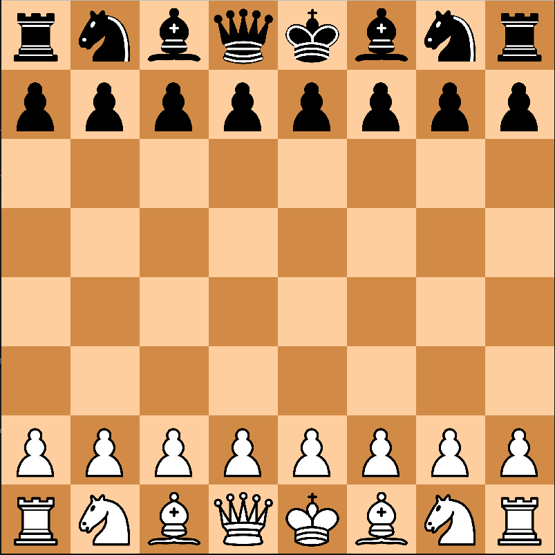
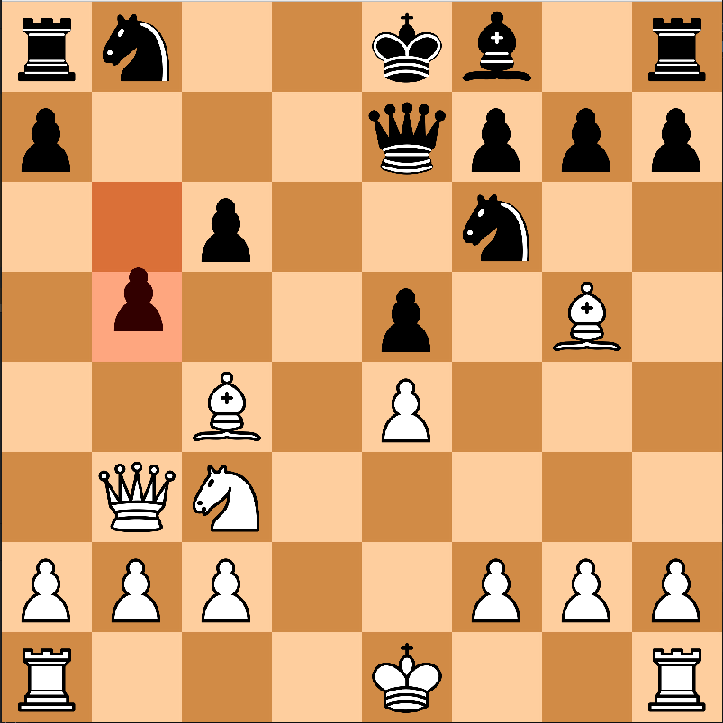

# ChessGame
This is my chess program built in C++ using SFML for graphics.

## Prerequisites:
- SFML 2.6.1
- C++17 or newer
- CMake 3.10+

## how to build (in Linux): 
1. Install SFML: https://www.sfml-dev.org/download/sfml/2.6.1/ - make sure to download version 2.6.1 as that's what it was built on
2. clone the repo: git clone https://github.com/ReeveW/ChessGame.git
3. go to directory: cd ChessGame
4. make build folder: mkdir build && cd build
5. run cmake: cmake ..
6. compile: make
7. run: ./ChessGame

## How to Play:
1. White moves first,
2. Drag and drop pieces to move them,
3. Legal moves are highlighted
4. Program will tell you in the terminal when a player has won
5. It's all standard chess rules, with everything implemented (promotion, castling, en passant)

## Screenshots:

## Future Plans
Will make directions for Windows in the future, I also want to make it a simple .exe for Windows as I imagine that's where the majority of people will be downloading it from.
I want to clean up my code a lot and use design principles I've learnt since I started. I built this with very little experience going into it and I feel I've learned so much that I can optimize and clean up a ton of stuff.
